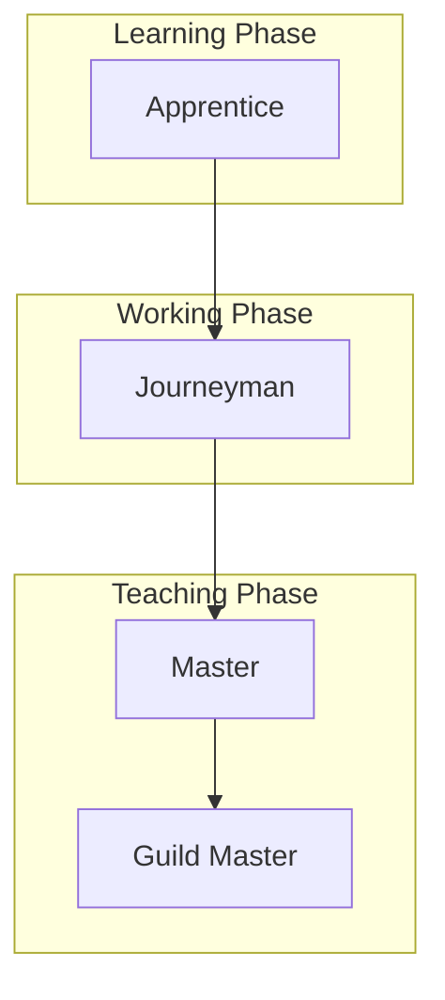

# Apprenticeship Model

**Origin:** Medieval guild system, formalized craft traditions

**Primary Focus:** Responsibility and teaching progression

## Overview

The Apprenticeship Model is one of the oldest learning frameworks, originating in medieval trade guilds. It describes progression from observation through mastery to teaching, emphasizing hands-on learning under expert guidance.

## The Five Stages

| Stage | Description |
|-------|-------------|
| **Observe** | Watch experts perform the craft |
| **Assist** | Help experts with supervised tasks |
| **Perform** | Work independently on full tasks |
| **Lead** | Guide others, take responsibility for outcomes |
| **Teach** | Train apprentices, preserve and advance the craft |

## Mapping to LEVER

| LEVER | Apprenticeship |
|-------|----------------|
| Learn | Observe |
| Execute | Assist, Perform |
| Value | Perform (mastery) |
| Enable | Lead, Teach |
| Replicate | Teach (at scale) |

### Analysis

**Learn ↔ Observe**

Apprentices begin by watching masters work. They learn vocabulary, patterns, and techniques through observation before attempting work themselves.

**Execute ↔ Assist, Perform**

Execute spans assisting (working with guidance) to performing (working independently on defined tasks). This maps well to LEVER's Execute stage.

**Value ↔ Perform (mastery)**

At full Perform, the journeyman can create value independently. They're trusted with complete projects and client work.

**Enable ↔ Lead, Teach**

Leading and teaching others maps directly to LEVER's Enable. Masters develop the next generation of practitioners.

**Replicate ↔ Teach (at scale)**

Master teachers who create guilds, schools, or lasting methodologies are replicating at scale. However, traditional apprenticeship focused on human-to-human transfer, not systems.

## The Traditional Progression



### Apprentice

- Bound to a master for learning
- Performs basic tasks
- Limited autonomy
- Typically 3-7 years

### Journeyman

- Completed apprenticeship
- Can work independently
- May travel to learn from multiple masters
- Typically "day worker" (journée)

### Master

- Demonstrated masterwork
- Can take apprentices
- Full guild membership
- Creates and teaches

## Strengths of Apprenticeship

- Time-tested over centuries
- Emphasizes hands-on learning
- Explicitly includes teaching
- Clear progression with milestones
- Community and tradition

## Limitations for LEVER's Purpose

- Human-to-human focus limits scale
- Designed for physical crafts
- No concept of systems or platforms
- Slow progression (years per stage)

## Key Insight

> Apprenticeship is the closest classical model to LEVER's full progression—it explicitly includes teaching. But it was designed when capability could only multiply through human relationships. LEVER extends this for the AI era.

## Modern Apprenticeship

| Traditional | Modern |
|-------------|--------|
| Physical craft | Knowledge work |
| Single master | Multiple mentors |
| Guild certification | Industry credentials |
| Local community | Global networks |
| Years of training | Accelerated learning |

## The AI-Era Extension

Traditional apprenticeship:

```
Master → Apprentice → Master → Apprentice
```

AI-era replication:

```
Master → Platform/Agent → Many Practitioners
```

LEVER's Replicate stage captures this new multiplication path that wasn't available to medieval craftsmen.

## Reference

Lave, J. & Wenger, E. (1991). *Situated Learning: Legitimate Peripheral Participation.* Cambridge University Press.
