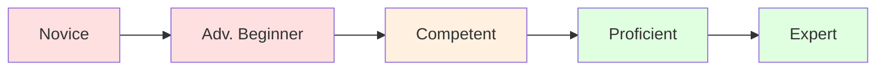

# Dreyfus Model

**Origin:** Stuart and Hubert Dreyfus, 1980

**Primary Focus:** Skill acquisition and independence

## Overview

The Dreyfus Model of Skill Acquisition describes how students acquire skills through formal instruction and practice. Originally developed to study pilot training, it's widely used in software engineering, medicine, and professional development.

## The Five Stages

| Stage | Description | Characteristic |
|-------|-------------|----------------|
| **Novice** | Follows rules exactly | "Tell me the steps" |
| **Advanced Beginner** | Recognizes patterns from experience | "I've seen this before" |
| **Competent** | Plans and prioritizes | "I can manage this" |
| **Proficient** | Sees situations holistically | "I know what matters here" |
| **Expert** | Operates intuitively | "I immediately see what's wrong" |

## Mapping to LEVER

| LEVER | Dreyfus |
|-------|---------|
| Learn | Novice |
| Execute | Advanced Beginner, Competent |
| Value | Proficient, Expert |
| Enable | — (not covered) |
| Replicate | — (not covered) |

### Analysis

**Learn ↔ Novice**

Novices are learning rules and fundamentals. They need explicit instructions and follow procedures exactly.

**Execute ↔ Advanced Beginner, Competent**

Execute spans pattern recognition (Advanced Beginner) to planning and prioritization (Competent). Both stages involve applying knowledge with varying degrees of guidance.

**Value ↔ Proficient, Expert**

Proficient practitioners see situations holistically. Experts operate intuitively. Both can create value independently—the hallmark of LEVER's Value stage.

**Enable ↔ Not Covered**

The original Dreyfus model stops at Expert. Some organizations add "Master" as an unofficial extension for those who develop others.

**Replicate ↔ Not Covered**

Dreyfus doesn't address system creation or capability multiplication. Some extensions add "Teacher" but this still focuses on human-to-human transfer.

## The Dreyfus Progression

Key transitions:

- **Novice → Advanced Beginner:** Rules become patterns
- **Advanced Beginner → Competent:** Patterns become plans
- **Competent → Proficient:** Plans become holistic understanding
- **Proficient → Expert:** Analysis becomes intuition

## Strengths of Dreyfus

- Research-backed progression
- Clear stages for skill development
- Widely adopted in professional contexts
- Describes the path from rule-following to intuition

## Limitations for LEVER's Purpose

- Stops at Expert (individual mastery)
- Doesn't address leadership or teaching
- No stages for capability multiplication
- Focused on skill acquisition, not impact

## Key Insight

> Dreyfus describes **how** expertise develops. LEVER asks: what happens after expertise—and how does that expertise multiply?

## Reference

Dreyfus, S.E. & Dreyfus, H.L. (1980). *A Five-Stage Model of the Mental Activities Involved in Directed Skill Acquisition.* University of California, Berkeley.
