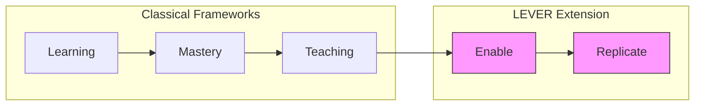

# Framework Mappings

LEVER synthesizes insights from multiple classical learning and mastery frameworks, extending them for the AI era.

## Why Mappings Matter

By formally mapping LEVER to established frameworks, we:

1. **Build on proven theory** — Leverage decades of research and practice
2. **Enable translation** — Help practitioners familiar with other frameworks understand LEVER
3. **Identify gaps** — Show where classical frameworks fall short
4. **Demonstrate rigor** — Ground LEVER in academic foundations

## The Classical Frameworks

| Framework | Era | Primary Focus |
|-----------|-----|---------------|
| [Bloom's Taxonomy](bloom.md) | 1956 | Cognitive mastery levels |
| [Dreyfus Model](dreyfus.md) | 1980 | Skill acquisition and independence |
| [Shu-Ha-Ri](shu-ha-ri.md) | Traditional | Relationship to rules and tradition |
| [Apprenticeship](apprenticeship.md) | Medieval | Responsibility and teaching progression |

## Summary Mapping Table

| LEVER | Bloom | Dreyfus | Shu-Ha-Ri | Apprenticeship |
|-------|-------|---------|-----------|----------------|
| **Learn** | Remember, Understand | Novice | Shu | Observe |
| **Execute** | Apply | Adv. Beginner, Competent | Shu | Assist, Perform |
| **Value** | Analyze, Evaluate | Proficient, Expert | Ha | Perform |
| **Enable** | Create | — | Ri | Lead, Teach |
| **Replicate** | — | — | Ri | Teach |

See the [full mapping table](mappings.md) for detailed analysis.

## Where LEVER Extends

Most classical frameworks implicitly assume:

- **Human effort** is the primary constraint
- **Teaching** is the main multiplication mechanism
- **Organizations** are required for scale

LEVER explicitly addresses:

- **AI augmentation** of capability
- **Systems** (platforms, agents, automation) as multiplication mechanisms
- **Individuals** reaching multiplication earlier in their careers

## Common Patterns

Despite their different origins, all frameworks share a similar progression:

1. **Dependence** — Following rules, needing guidance
2. **Independence** — Working autonomously, making decisions
3. **Multiplication** — Scaling impact through others or systems

LEVER's contribution is making this explicit and extending it for the AI era.

## Framework Deep Dives

- [Bloom's Taxonomy](bloom.md) — Cognitive learning objectives
- [Dreyfus Model](dreyfus.md) — Skill acquisition stages
- [Shu-Ha-Ri](shu-ha-ri.md) — Japanese mastery concept
- [Apprenticeship](apprenticeship.md) — Traditional craft progression
- [Mapping Table](mappings.md) — Complete cross-reference
