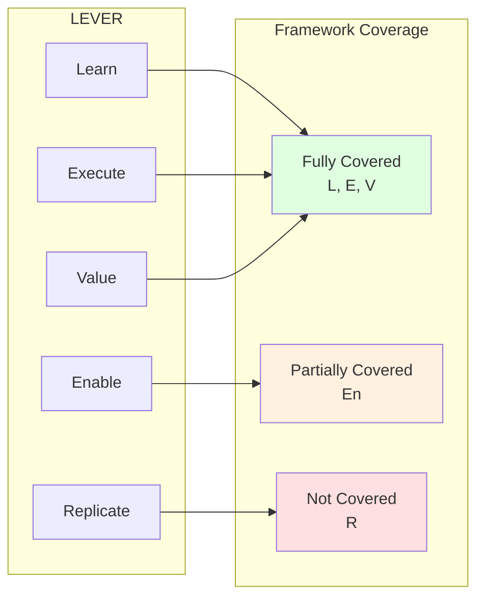

# Mapping Table

This page provides the complete cross-reference between LEVER stages and classical frameworks.

## Full Mapping Matrix

| LEVER | Bloom's Taxonomy | Dreyfus Model | Shu-Ha-Ri | Apprenticeship | Conscious Competence |
|-------|------------------|---------------|-----------|----------------|---------------------|
| **Learn** | Remember, Understand | Novice | Shu | Observe | Unconscious → Conscious Incompetence |
| **Execute** | Apply | Adv. Beginner, Competent | Shu | Assist, Perform | Conscious Competence |
| **Value** | Analyze, Evaluate | Proficient, Expert | Ha | Perform | Unconscious Competence |
| **Enable** | Create | — | Ri | Lead, Teach | Reflective Mastery* |
| **Replicate** | — | — | Ri | Teach | — |

*Extended stage, not in original model

## Stage-by-Stage Analysis

### Learn

| Framework | Stage(s) | Notes |
|-----------|----------|-------|
| Bloom | Remember, Understand | Knowledge acquisition covers basic recall and comprehension |
| Dreyfus | Novice | Novices are learning rules and fundamentals |
| Shu-Ha-Ri | Shu | Shu is about learning and following the forms |
| Apprenticeship | Observe | Observation is the primary learning mechanism |
| Conscious Competence | UI → CI | Learning begins with awareness of the gap |

### Execute

| Framework | Stage(s) | Notes |
|-----------|----------|-------|
| Bloom | Apply | Execution is the application of learned knowledge |
| Dreyfus | Adv. Beginner, Competent | Spans pattern recognition to planning |
| Shu-Ha-Ri | Shu | Still within Shu—applying the learned forms |
| Apprenticeship | Assist, Perform | Execution spans assisted to independent work |
| Conscious Competence | CC | Deliberate, effortful performance |

### Value

| Framework | Stage(s) | Notes |
|-----------|----------|-------|
| Bloom | Analyze, Evaluate | Creating value requires analysis and judgment |
| Dreyfus | Proficient, Expert | Holistic understanding and intuition |
| Shu-Ha-Ri | Ha | Breaking from tradition, understanding context |
| Apprenticeship | Perform | Full independent performance with proven results |
| Conscious Competence | UC | Automatic, reliable performance |

### Enable

| Framework | Stage(s) | Notes |
|-----------|----------|-------|
| Bloom | Create | Enabling often requires creating new approaches |
| Dreyfus | — | Not directly addressed; some add "Master" |
| Shu-Ha-Ri | Ri | Ri practitioners often become teachers |
| Apprenticeship | Lead, Teach | Leading and teaching others |
| Conscious Competence | — | Often called "Reflective Mastery" in extensions |

### Replicate

| Framework | Stage(s) | Notes |
|-----------|----------|-------|
| Bloom | — | Beyond Bloom—multiplication not addressed |
| Dreyfus | — | Beyond Dreyfus—some add "Teacher" level |
| Shu-Ha-Ri | Ri | Advanced Ri—creating new schools and approaches |
| Apprenticeship | Teach | Master teachers who create schools and guilds |
| Conscious Competence | — | Beyond the model—requires conscious articulation |

## Coverage Analysis

### What Classical Frameworks Cover Well

- **Knowledge acquisition** (Learn)
- **Skill application** (Execute)
- **Expertise development** (Value)

### Where Classical Frameworks Fall Short

- **Developing others** (Enable) — Partially covered by Apprenticeship
- **System creation** (Replicate) — Not addressed by any classical framework

## The LEVER Extension

LEVER's contribution is making explicit what classical frameworks leave implicit or ignore:

1. **Enable as a distinct stage** — Not just "what experts eventually do" but a specific capability
2. **Replicate as AI-era multiplication** — Systems, platforms, and agents as multiplication mechanisms
3. **Personal vs Leveraged** — Clear distinction between individual and multiplied capability

## Implications

### For Curriculum Design

Use Bloom and Dreyfus for Learn/Execute/Value stages. Use LEVER for Enable/Replicate.

### For Career Ladders

Classical frameworks inform IC progression. LEVER extends to leadership and multiplication.

### For Assessment

Different frameworks may be appropriate for different stages:

| Stage | Best Framework for Assessment |
|-------|------------------------------|
| Learn | Bloom (cognitive levels) |
| Execute | Dreyfus (skill independence) |
| Value | Dreyfus + outcome metrics |
| Enable | Leadership frameworks |
| Replicate | Impact metrics |
