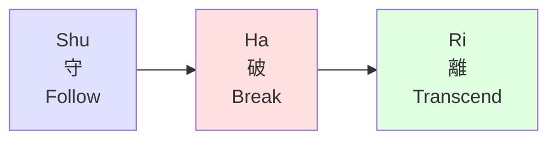

# Shu-Ha-Ri

**Origin:** Japanese martial arts tradition, popularized in software by Alistair Cockburn

**Primary Focus:** Relationship to rules and tradition

## Overview

Shu-Ha-Ri (守破離) is a Japanese concept describing the stages of learning to mastery. It originated in martial arts and tea ceremony but has been widely adopted in software craftsmanship and Agile communities.

## The Three Stages

| Stage | Japanese | Meaning | Description |
|-------|----------|---------|-------------|
| **Shu** | 守 | Protect/Obey | Follow the rules exactly, learn the forms |
| **Ha** | 破 | Detach/Break | Break from tradition, understand when rules bend |
| **Ri** | 離 | Leave/Transcend | Create your own approach, rules become instinct |

## Mapping to LEVER

| LEVER | Shu-Ha-Ri |
|-------|-----------|
| Learn | Shu |
| Execute | Shu |
| Value | Ha |
| Enable | Ri |
| Replicate | Ri |

### Analysis

**Learn, Execute ↔ Shu**

In Shu, the practitioner follows the master's teachings exactly. They don't question or modify—they absorb. This maps to both Learn (absorbing knowledge) and Execute (applying it faithfully).

**Value ↔ Ha**

Ha is where the practitioner begins to understand *why* the rules exist. They can break from tradition when context demands. This corresponds to LEVER's Value—independent judgment and outcome creation.

**Enable, Replicate ↔ Ri**

At Ri, the practitioner transcends the rules. They create their own style and often become teachers who establish new schools. This maps to both Enable (teaching) and Replicate (creating new approaches).

## The Shu-Ha-Ri Journey

### Shu (守) — Protect

- Follow the teacher exactly
- Don't question the forms
- Practice until techniques become automatic
- Trust the tradition

### Ha (破) — Break

- Understand the principles behind the forms
- Question when rules apply
- Adapt techniques to new situations
- Develop personal style within tradition

### Ri (離) — Leave

- Transcend the forms entirely
- Create new approaches
- Rules become instinct
- May establish new schools

## Strengths of Shu-Ha-Ri

- Elegant simplicity
- Emphasizes respect for tradition before innovation
- Captures the journey from imitation to creation
- Popular in craftsmanship-oriented communities

## Limitations for LEVER's Purpose

- Very high-level (only three stages)
- Doesn't distinguish learning from execution
- Multiplication through systems not addressed
- Originally designed for master-apprentice relationships

## Key Insight

> Shu-Ha-Ri describes the **relationship to rules**. LEVER asks: what do you produce at each stage, and how does impact multiply?

## In Software

Alistair Cockburn brought Shu-Ha-Ri to software development:

| Stage | Software Example |
|-------|------------------|
| Shu | Follow Scrum by the book |
| Ha | Adapt Scrum to team context |
| Ri | Create new methodology |

## Reference

Cockburn, A. (2006). *Agile Software Development: The Cooperative Game* (2nd ed.). Addison-Wesley.
