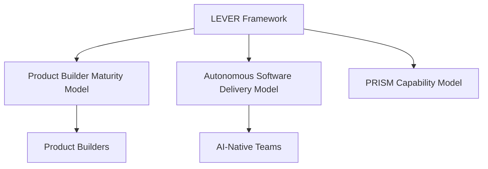

# LEVER Capability Framework

**Learn • Execute • Value • Enable • Replicate**

LEVER is a capability multiplication framework that synthesizes classical learning models—Bloom's Taxonomy, Dreyfus Model, Shu-Ha-Ri, and Apprenticeship—for the AI era.

## Core Thesis

!!! quote "The AI-Era Insight"
    AI does not merely make experts more productive. It enables experts to become **multipliers** much sooner in their careers through agents, workflows, platforms, and standards.

## The Five Stages

| Stage | Question | Output |
|-------|----------|--------|
| **[Learn](stages/learn.md)** | What do I know? | Knowledge |
| **[Execute](stages/execute.md)** | What can I do? | Results |
| **[Value](stages/value.md)** | Can I independently create outcomes? | Measurable outcomes |
| **[Enable](stages/enable.md)** | Can I make others successful? | Capable people |
| **[Replicate](stages/replicate.md)** | Can I make success repeatable at scale? | Systems |

## Stage Progression

```
Personal Capability          Leveraged Capability
─────────────────────        ────────────────────
Learn → Execute → Value      Enable → Replicate
```

The first three stages develop **personal capability**—the individual becomes proficient and trusted.

The last two stages create **leveraged capability**—impact multiplies through people and systems.

## Why LEVER?

### Classical Frameworks Fall Short

Existing learning and mastery frameworks were designed when:

- Knowledge was scarce
- Labor was human
- Scale required organizations

They typically stop at "Expert" or "Teacher" without addressing how capability can be multiplied through AI, automation, platforms, and institutions.

### LEVER Extends the Model

LEVER recognizes that in the AI era:

- **Teaching** is one form of multiplication, but not the only one
- **Systems** (agents, platforms, standards) can multiply capability at scale
- **Individuals** can become multipliers much earlier in their careers

## Framework Mappings

LEVER maps to classical frameworks, showing where it synthesizes and extends them:

| LEVER | Bloom | Dreyfus | Shu-Ha-Ri | Apprenticeship |
|-------|-------|---------|-----------|----------------|
| Learn | Remember, Understand | Novice | Shu | Observe |
| Execute | Apply | Advanced Beginner, Competent | Shu | Assist, Perform |
| Value | Analyze, Evaluate | Proficient, Expert | Ha | Perform |
| Enable | Create | — | Ri | Lead, Teach |
| Replicate | — | — | Ri | Teach |

See [Framework Mappings](frameworks/index.md) for detailed analysis.

## Domain Profiles

LEVER can be interpreted for specific domains through **Profiles**:

- **[Product Builder](profiles/product-builder.md)** — End-to-end product ownership
- **[Software Engineer](profiles/engineer.md)** — Technical delivery

Profiles define domain-specific competencies, evidence, and examples for each LEVER stage.

## Quick Start

=== "Go"

    ```bash
    go get github.com/ProductBuildersHQ/lever
    ```

    ```go
    import "github.com/ProductBuildersHQ/lever/pkg/lever"

    spec := lever.NewSpec()
    stages := lever.Stages()
    ```

=== "TypeScript"

    ```bash
    npm install @productbuildershq/lever zod
    ```

    ```typescript
    import { specSchema, STAGES, STAGE_PROGRESSION } from '@productbuildershq/lever';

    console.log(STAGES); // ['learn', 'execute', 'value', 'enable', 'replicate']
    ```

=== "CLI"

    ```bash
    go run github.com/ProductBuildersHQ/lever/cmd/lever@latest stages
    ```

## Ecosystem

LEVER is the foundational theory for:

| Framework | Purpose | Link |
|-----------|---------|------|
| **LEVER** | Human capability progression | This site |
| **PBMM** | Product Builder Maturity Model | [ProductBuildersHQ](https://productbuildershq.com) |
| **ASDM** | Autonomous Software Delivery Model | [ProductBuildersHQ](https://productbuildershq.com) |
| **PRISM** | Organizational capability maturity | Coming soon |



## License

LEVER is open source under the [MIT License](https://github.com/ProductBuildersHQ/lever/blob/main/LICENSE).
