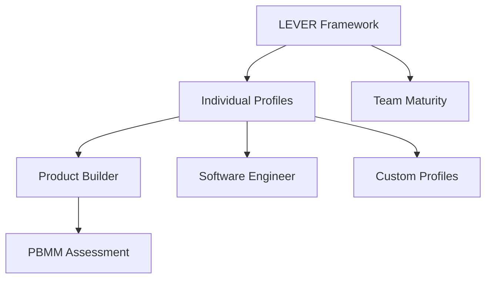

# Domain Profiles

LEVER is a universal framework. **Profiles** adapt it to specific domains, defining what each stage means in context.

## What is a Profile?

A Profile provides domain-specific interpretation of LEVER stages:

- **Stage titles** — Domain-appropriate names (e.g., "Builder" instead of "Value")
- **Descriptions** — What each stage means in this domain
- **Competencies** — Specific capabilities at each stage
- **Evidence** — Observable indicators of stage attainment
- **Examples** — Concrete illustrations

## Reference Profiles

LEVER includes two reference profiles:

| Profile | Domain | Description |
|---------|--------|-------------|
| [Product Builder](product-builder.md) | Product | End-to-end product ownership |
| [Software Engineer](engineer.md) | Engineering | Technical delivery |

## Profile Structure

```yaml
profile:
  id: product-builder
  name: Product Builder
  domain: product
  stage_interpretations:
    - stage_id: learn
      title: Learner
      description: Acquiring product, technology, and business knowledge
      evidence:
        - Completes relevant courses
        - Studies successful products
      examples:
        - Takes product management courses
        - Learns AI coding assistants
```

## Creating Custom Profiles

Organizations can create profiles for their specific roles:

### 1. Define the Domain

What area does this profile cover?

- Product
- Engineering
- Design
- Leadership
- Sales
- etc.

### 2. Interpret Each Stage

For each LEVER stage, define:

| Element | Question |
|---------|----------|
| Title | What do we call this level? |
| Description | What does this stage mean here? |
| Evidence | How do we know someone is at this stage? |
| Examples | What does this look like in practice? |

### 3. Define Competencies (Optional)

Specific capabilities with observable indicators:

```yaml
competencies:
  - id: customer-discovery
    name: Customer Discovery
    description: Ability to identify and validate customer needs
    indicators:
      - Conducts effective user interviews
      - Synthesizes feedback into insights
      - Identifies patterns across conversations
```

## Profile Examples by Domain

### Engineering Domains

- **Software Engineer** — General software development
- **Platform Engineer** — Internal developer platforms
- **ML Engineer** — Machine learning systems
- **Security Engineer** — Security and compliance

### Product Domains

- **Product Builder** — Full-stack product ownership
- **Product Manager** — Traditional PM focus
- **Product Designer** — Design-focused product role

### Leadership Domains

- **Engineering Manager** — Technical leadership
- **Product Leader** — Product organization leadership
- **Executive** — C-level progression

## Using Profiles

### Assessment

Profiles provide criteria for evaluating where someone is on the LEVER progression:

1. Review evidence requirements for each stage
2. Evaluate demonstrated competencies
3. Identify current stage and growth areas

### Development Planning

Use profiles to create growth plans:

1. Identify current stage
2. Review requirements for next stage
3. Create development activities targeting gaps

### Career Ladders

Profiles can inform career ladder design:

| LEVER Stage | Example Title |
|-------------|---------------|
| Learn | Associate Engineer |
| Execute | Engineer |
| Value | Senior Engineer |
| Enable | Staff Engineer |
| Replicate | Principal Engineer |

## Relationship to PBMM and ASDM

**PBMM** (Product Builder Maturity Model) is essentially the Product Builder profile with detailed assessment criteria.

**ASDM** (Autonomous Software Delivery Model) applies LEVER concepts to team capability rather than individual profiles.



## Next Steps

- [Product Builder Profile](product-builder.md)
- [Software Engineer Profile](engineer.md)
- [Usage: Go Library](../usage/go.md) — Creating profiles programmatically
