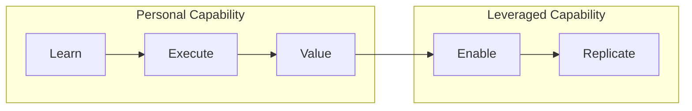

# The Five Stages

LEVER defines five progressive stages of capability development, from initial learning to capability multiplication.

## Overview

## The Progression

| Stage | Question | Output | Focus |
|-------|----------|--------|-------|
| **[Learn](learn.md)** | What do I know? | Knowledge | Acquiring concepts and mental models |
| **[Execute](execute.md)** | What can I do? | Results | Applying knowledge to produce work |
| **[Value](value.md)** | Can I independently create outcomes? | Measurable outcomes | Demonstrating trusted, independent capability |
| **[Enable](enable.md)** | Can I make others successful? | Capable people | Developing others through mentoring and leadership |
| **[Replicate](replicate.md)** | Can I make success repeatable at scale? | Systems | Creating scalable capability through systems |

## Personal vs Leveraged Capability

### Personal Capability (L-E-V)

The first three stages focus on building individual capability:

- **Learn** — Build the foundation of knowledge
- **Execute** — Apply knowledge to produce results
- **Value** — Demonstrate independent ability to create outcomes

At the end of Value, a practitioner can be trusted to work independently and deliver measurable results.

### Leveraged Capability (E-R)

The final two stages shift focus from personal output to multiplied impact:

- **Enable** — Develop capability in others
- **Replicate** — Create systems that scale capability

!!! info "The AI-Era Extension"
    Classical frameworks like Dreyfus stop at "Expert." LEVER adds **Enable** and **Replicate** to capture how capability multiplies—especially important in the AI era where one person can leverage agents, platforms, and automation.

## Output Evolution

Each stage produces a different type of output:

| Stage | Output | Example |
|-------|--------|---------|
| Learn | Knowledge | Understanding Kubernetes concepts |
| Execute | Work | Deploying an application |
| Value | Outcomes | Improving system reliability by 40% |
| Enable | People | Mentoring three engineers to senior level |
| Replicate | Systems | Creating a platform used by 50 teams |

## Characteristics by Stage

### Learn
- Studies concepts and terminology
- Follows instructions and tutorials
- Asks questions to understand
- Builds foundational mental models

### Execute
- Completes assigned tasks
- Applies learned techniques
- Requires supervision and guidance
- Produces work product with support

### Value
- Works independently
- Makes sound decisions
- Delivers measurable outcomes
- Earns trust through results
- Solves problems autonomously

### Enable
- Mentors and coaches others
- Teaches effectively
- Builds team capability
- Multiplies impact through people
- Creates psychological safety

### Replicate
- Creates reusable frameworks
- Builds platforms and tools
- Defines standards and best practices
- Develops AI agents and automation
- Establishes institutions and communities
- Scales impact through systems

## Stage Transitions

Each transition represents a fundamental shift:

| Transition | Shift |
|------------|-------|
| Learn → Execute | From theory to practice |
| Execute → Value | From supervised to independent |
| Value → Enable | From individual to team focus |
| Enable → Replicate | From people to systems |

## Next Steps

Explore each stage in detail:

- [Learn](learn.md) — Knowledge acquisition
- [Execute](execute.md) — Skill application
- [Value](value.md) — Independent outcomes
- [Enable](enable.md) — Developing others
- [Replicate](replicate.md) — System creation
